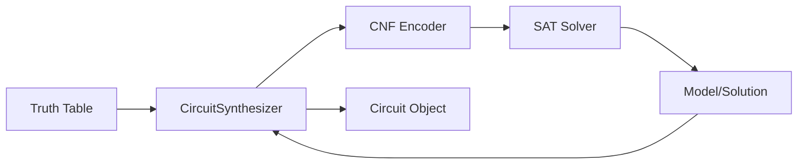

# System Architecture

## Overview

SAT RevSynth transforms the problem of finding a reversible circuit into a Boolean Satisfiability (SAT) problem.

## Synthesis Pipeline

1.  **Input**: A target `TruthTable` (permutation of bitstrings) and a `gate_count` $k$.
2.  **Encoding**: `CircuitSynthesizer` builds a CNF formula.
    - **Variables**:
        - $c_{i,j}$: Wire $i$ is a control for gate $j$.
        - $t_{i,j}$: Wire $i$ is the target for gate $j$.
        - $d_{w,j,i}$: Value of wire $i$ at step $j$ for input word $w$.
    - **Constraints**:
        - Each gate has exactly 1 target.
        - Target cannot be a control.
        - Data flow: $d_{next} = d_{curr} \oplus (controls \dots)$.
        - Boundary conditions: $d_{start} = input$, $d_{end} = output$.
3.  **Solving**: The CNF is passed to an external SAT solver (e.g., Kissat, CaDiCaL) or a builtin one.
4.  **Decoding**: If SAT, the variable assignments for $c$ and $t$ dictate the circuit structure.

## Database Schema (LMDB)

We use LMDB for high-performance storage of millions of templates. The storage is organized into several named databases:

| Database Name | Key Format | Value | Description |
|---|---|---|---|
| `templates_by_hash` | `basis(1)\|w(1)\|gc(2)\|hash(32)` | `TemplateRecord` | Main storage. Fast lookup by canonical hash. |
| `template_families` | `basis(1)\|family_hash(32)` | `[id, id, ...]` | List of template IDs belonging to the same equivalence class. |
| `templates_by_dims` | `basis(1)\|w(1)\|gc(2)\|id(8)` | `hash` | Index to enumerate all templates of a specific size. |
| `witnesses_by_hash` | `basis(1)\|w(1)\|len(2)\|hash(32)` | `WitnessRecord` | De-duplicated storage for witness sequences. |
